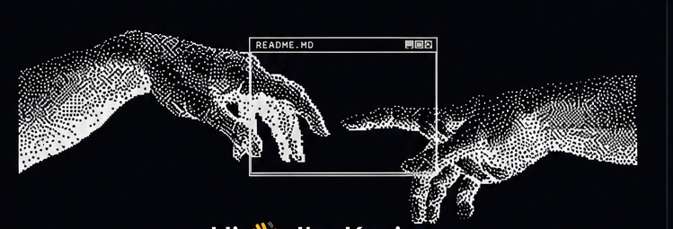
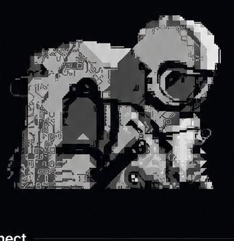

  

<h1 align="center">Hi 👋, I'm Kevin</h1>

<h3 align="center">Full-Stack Developer</h3>

  

Building practical web applications with clean architecture and modern technologies.

<h2 align="center">🚀 About Me</h2>

**Kevin**, here — Systems Engineer graduated from Universidad de Córdoba (Montería, Colombia), focused on full-stack development.

I work with a planning-first approach: documenting requirements and designing the architecture before writing a single line of code. I enjoy turning that groundwork into real, working applications.

Currently building **HydrApp**, a hydration-tracking PWA integrating the Groq API, architected for a Render backend and Vercel frontend.

Recently completed a 120-hour **Diplomado en Desarrollo de Aplicaciones Web con Herramientas Cloud** (Unicordoba, 2026).

My goal is simple: keep learning, build useful software, and grow into a well-rounded software engineer who creates reliable solutions.

 

<h2 align="center">🤝 Connect</h2>

  
  &nbsp;&nbsp;&nbsp;
  
  &nbsp;&nbsp;&nbsp;
  

<h2 align="center">💻 Tech Stack</h2>

<b>Languages</b>

  

<b>Frameworks & Libraries</b>

  

<b>Databases & Tools</b>

  

<h2 align="center">📊 GitHub Stats</h2>

  
  &nbsp;&nbsp;
  

<h2 align="center">📈 Activity Graph</h2>

  

<h2 align="center">⌘ Philosophy</h2>

  

  

